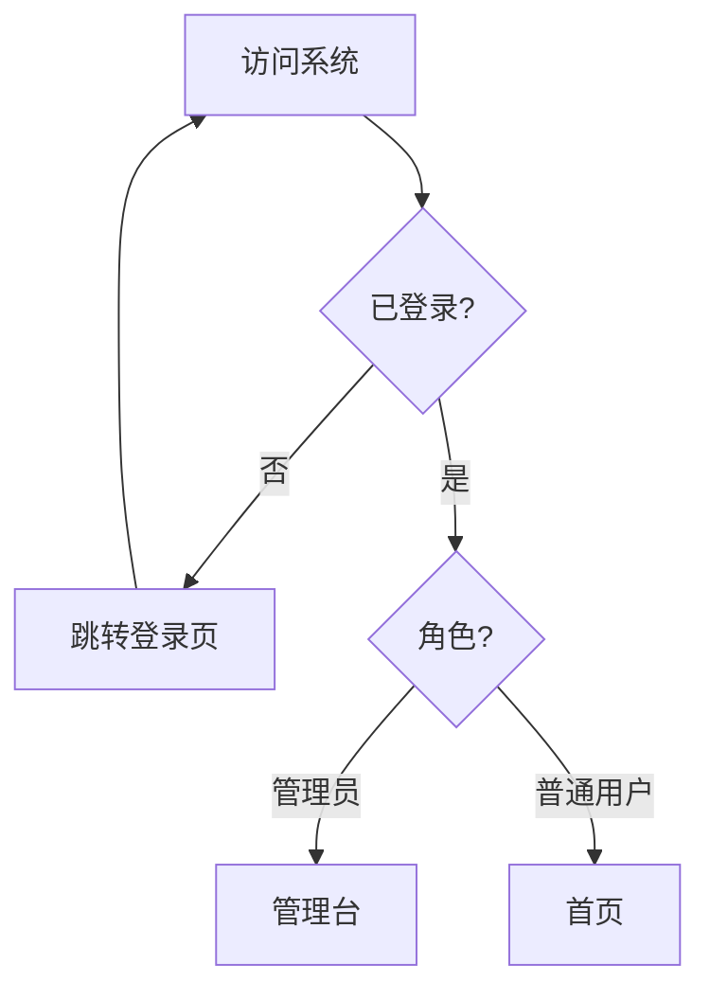

# mermaid-buddy

[](https://github.com/YuAICode/ai-skills/tree/main/skills/mermaid-buddy)
[](../../LICENSE)

把代码或中文描述转成 Mermaid 图（流程图 / 时序图 / 类图 / ER 图 / 状态图 / 甘特图），包在 ` ```mermaid ` 代码块里，直接贴 README / 掘金 / Notion。

## 安装

把本目录拷进 Claude Code 的 skills 目录，重启后即可触发：

```bash
# 全局（所有项目可用）
cp -r mermaid-buddy ~/.claude/skills/

# 或 项目级（只在当前项目生效）
cp -r mermaid-buddy .claude/skills/
```

## 用法

### 触发词

直接说出触发词，Claude 会自动运行本 skill：

- `/mermaid-buddy`
- `帮我画个流程图`
- `生成 mermaid`
- `这段代码转成时序图`
- `画个 ER 图`
- `帮我画个状态图`
- `用 mermaid 画……`

### 模式 A：描述生成

用中文描述系统或流程，Claude 选择合适的图类型并产出：

```
用户登录后判断角色，管理员进管理台，普通用户进首页，未登录跳转登录页。帮我画个流程图。
```

输出：

````

````

### 模式 B：代码转图

粘贴一段代码，Claude 提取结构并生成对应图：

```
// 把下面这段 Go 代码的调用链画成时序图
func HandleLogin(w, r) {
    user := db.FindUser(r.email)
    token := auth.Sign(user)
    w.Write(token)
}
```

输出时序图，展示 Handler → DB → Auth → 响应的调用顺序。

## 支持的图类型

| 图类型 | Mermaid 声明 | 适用场景 |
|--------|-------------|---------|
| 流程图 | `graph TD` | 业务流程、决策分支、算法步骤 |
| 时序图 | `sequenceDiagram` | 服务调用、API 请求响应 |
| 类图 | `classDiagram` | OOP 类结构、继承组合 |
| ER 图 | `erDiagram` | 数据库表关系 |
| 状态图 | `stateDiagram-v2` | 状态机、生命周期 |
| 甘特图 | `gantt` | 项目排期、里程碑 |

## 渲染平台

生成的 ` ```mermaid ` 代码块可直接粘贴到：

- **GitHub** Markdown（Issues / PR / Wiki / README）
- **掘金** 文章编辑器
- **Notion** 页面
- **[Mermaid Live Editor](https://mermaid.live)**（本地实时预览）

## 硬规则摘要

- 节点文字含括号 / 引号 / 中文标点时，用 `["..."]` 包裹，避免语法错误
- 生成后自检：类型声明、箭头配对、subgraph 闭合、特殊字符转义
- 节点 ID 只用英文 / 数字，标签可用中文
- 产出务必用 ` ```mermaid ` 围栏，不裸输出代码

完整工作流、模板与硬规则见 [SKILL.md](./SKILL.md)。

## License

[MIT](../../LICENSE)
