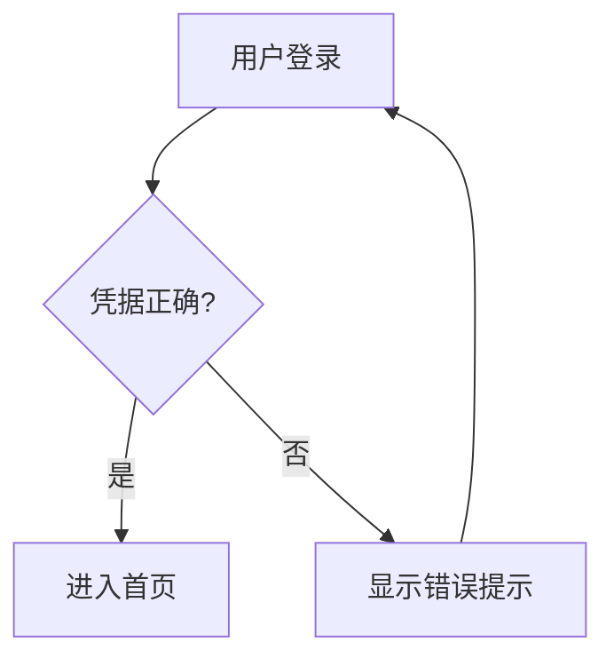
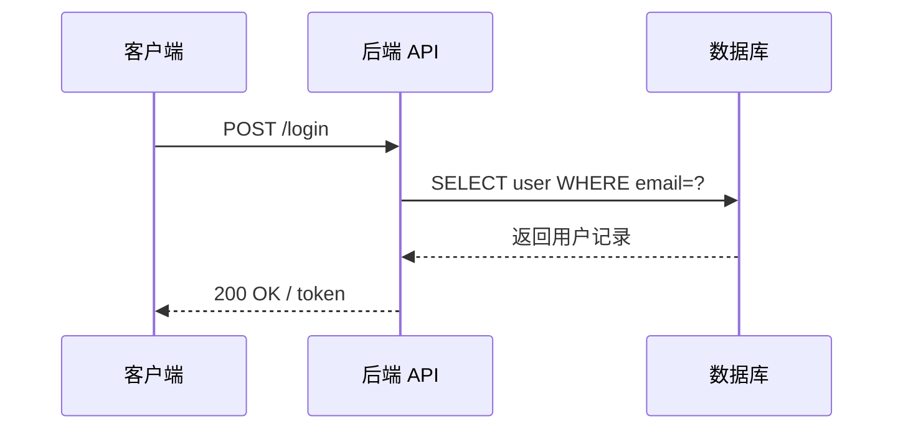
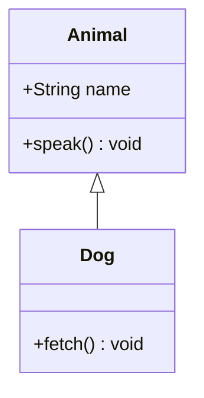
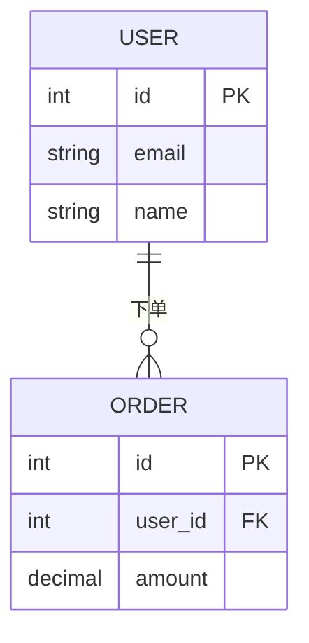
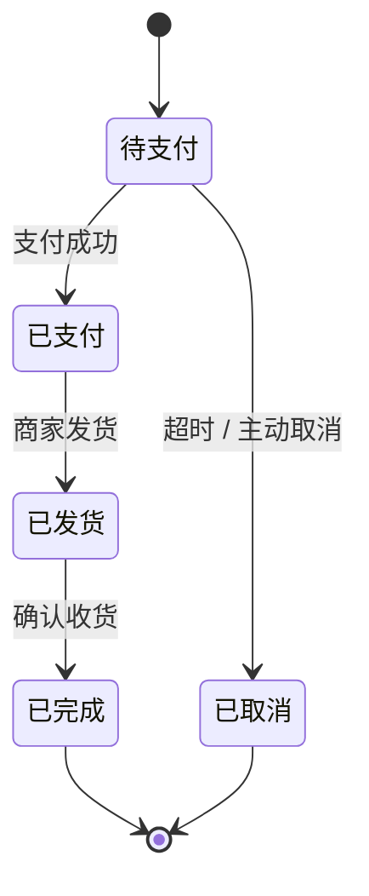
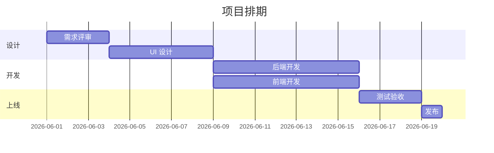

# mermaid-buddy — 中文描述 / 代码 → Mermaid 图

把一句中文描述或一段代码,变成可以直接粘贴到 GitHub / 掘金 / Notion 的 Mermaid 图。
选对图类型、写合法语法、自检节点名——一步到位。

## 何时触发

用户说：
- `/mermaid-buddy`
- "帮我画个流程图"
- "生成 mermaid"
- "这段代码转成时序图"
- "画个 ER 图"
- "把这个函数的调用关系画出来"
- "我想要一张状态图 / 甘特图 / 类图"
- "用 mermaid 帮我画……"

## 两种工作模式

### 模式 A：描述生成

用户用中文描述系统、流程或业务逻辑 → 选合适图类型 → 产出 Mermaid 代码块。

**流程：**
1. 读懂描述,判断最适合的图类型（见「图类型选择指引」）。
2. 若需求模糊（如"帮我画个图"），先给出类型建议并简要说明理由,再产出。
3. 按「模板库」的格式生成，中文节点文字用 `["..."]` 包裹。
4. 自检语法（见「硬规则 §自检清单」）。
5. 输出：
   - 一个 ` ```mermaid ` 代码块
   - 2~3 句中文说明：图的主线逻辑 + 关键分支/关系
   - 渲染提示（首次或用户未提过平台时给）

---

### 模式 B：代码转图

用户粘贴一段代码（函数/类/调用链/Schema 等） → 提取结构 → 生成流程图或时序图（或类图/ER 图）。

**流程：**
1. 扫描代码，识别：
   - 函数调用链 → **flowchart** 或 **sequenceDiagram**（有明确调用方/被调方时选时序图）
   - 类定义与继承/组合 → **classDiagram**
   - 数据库表 / struct → **erDiagram**
   - if / switch / 状态机 → **flowchart** 或 **stateDiagram-v2**
2. 若代码过长，只提取关键路径（主干 + 主要分支），不逐行翻译。
3. 按选定模板生成，节点 ID 用英文/数字，节点标签用原始中文或英文名称。
4. 自检语法后输出。

---

## 图类型选择指引

| 需求场景 | 推荐图类型 |
|---------|-----------|
| 业务流程 / 决策分支 / 算法步骤 | `graph TD`（flowchart，纵向）|
| 服务间调用 / API 请求响应 / 时间顺序 | `sequenceDiagram` |
| 面向对象类结构 / 继承组合 | `classDiagram` |
| 数据库表关系 / 实体关系 | `erDiagram` |
| 状态机 / 生命周期 / 有限自动机 | `stateDiagram-v2` |
| 项目排期 / 里程碑 | `gantt` |

当多种图类型都合适时，先给出主图，再说"也可以用 X 图从 Y 角度看"。

---

## 模板库（最小例子）

### flowchart（流程图）



### sequenceDiagram（时序图）



### classDiagram（类图）



### erDiagram（ER 图）



### stateDiagram-v2（状态图）



### gantt（甘特图）



---

## 硬规则

### 节点名安全

- 节点文字含**括号、引号、冒号、中文标点**时，必须用 `["..."]` 包裹，否则 Mermaid 解析器报错。
  - 正确：`A["getUserInfo()"]`
  - 错误：`A[getUserInfo()]`
- 节点 **ID**（箭头左右的标识符）只用英文字母、数字、下划线，不含空格。
- 中文标签本身没问题，放在 `["中文"]` 里即可。

### 自检清单（生成后逐项确认，再输出）

1. **类型声明正确**：首行是 `graph TD` / `sequenceDiagram` / `classDiagram` 等已知类型。
2. **箭头配对**：`-->` / `->>` / `-->>` 每条边都有起点和终点。
3. **subgraph 闭合**：有 `subgraph` 就必须有对应的 `end`。
4. **节点特殊字符已转义**：括号/引号/中文标点均在 `["..."]` 内。
5. **erDiagram 关系符合规范**：`||--o{` / `||--|{` / `}o--o{` 等，不自造符号。
6. **stateDiagram-v2 初态/终态**：有 `[*] -->` 入口和 `--> [*]` 出口。
7. **gantt dateFormat 已声明**：使用了日期就必须有 `dateFormat` 行。

### 输出格式约束

- **务必用 ` ```mermaid ` 围栏**，不裸输出图代码。
- 代码块后附 2~3 句中文说明主线逻辑。
- 首次使用或用户未提过平台时，附渲染提示：
  > 可直接粘贴到 GitHub Markdown、掘金文章、Notion 页面——这些平台原生渲染 Mermaid 代码块。本地预览可用 [Mermaid Live Editor](https://mermaid.live)。

### 不做的事

- 不输出截图或图片文件，只输出代码块。
- 不执行任何写文件操作；图的代码由用户自行复制粘贴。
- 代码太长时不逐行翻译，只提取关键路径。
- 不臆造 Mermaid 语法——不确定的节点关系符号必须查模板或说明"请用 Mermaid Live Editor 验证"。

---

## 边界

- 适用所有文本输入（中文描述 / 代码 / 表结构 / 流程说明）。
- 纯 Claude 驱动，**无需 bin/ 脚本**，价值在模板约束和自检规则。
- 不支持将现有图片反向解析为 Mermaid 代码。
- 若用户需要 PlantUML / Draw.io 格式，说明"本 skill 仅产出 Mermaid"，不兼容其他格式。
- 复杂大图（节点 > 30）建议拆成多张子图，并给出拆分建议。
